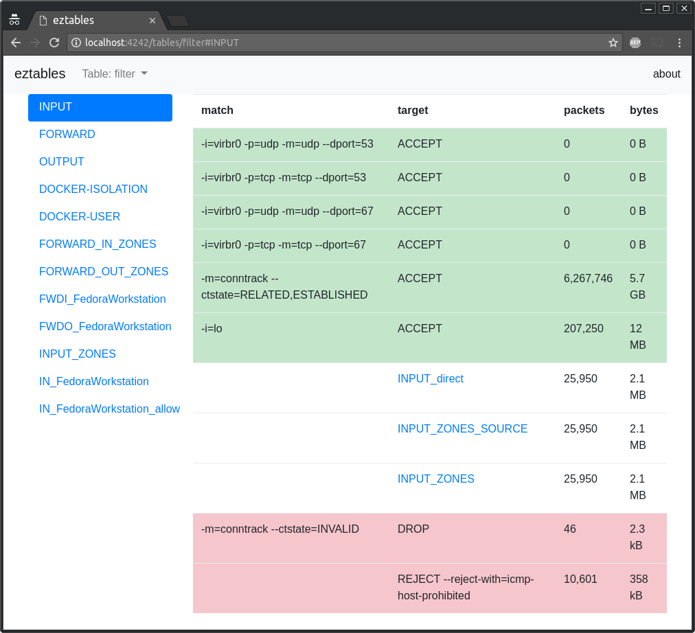

# eztables

[](https://travis-ci.org/posener/eztables)
[](https://codecov.io/gh/posener/eztables)
[](http://godoc.org/github.com/posener/eztables)
[](https://goreportcard.com/report/github.com/posener/eztables)

Easy to understand web view of iptables rules



## Run with Docker

```bash
docker run --rm --net host --privileged posener/eztables
```

> You should have docker installed, configured and running

## Install

```bash
go get -u github.com/posener/eztables
bash -c "sudo cp $(which eztables) /usr/bin/"
```

> `eztables` must run with root privileges since it runs `iptables` as a sub process.
> Therefore, I recommend copy the executable to `/usr/bin`.

## Usage

```bash
sudo eztables
```

> `eztables` should run with root privileges, since it runs `iptables` as a sub process.

